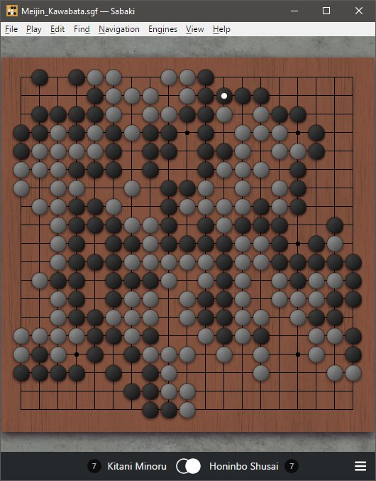

# Walnut Theme for [Sabaki](http://sabaki.yichuanshen.de/)

I made this theme because I wanted a theme that had less sharp contrast and looked better as a dark theme and at night or in low light situations.

I hope you enjoy it. Improvements are welcome.

## Installation

* For Sabaki 31 or newer
* Download [walnut.sabakitheme.asar](https://github.com/kakakhel/sabaki-walnut-theme/releases)
* Preferences > Themes > Install Theme

## Credits

* I took the granite background image from [OGS](https://github.com/online-go/online-go.com/blob/devel/assets/img/granite.jpg).
* I took the walnut board image from [OGS](https://github.com/online-go/online-go.com/blob/devel/assets/img/black_walnut.jpg).
* I took the white stone image from [OGS](Cannot Find the Image, Sorry.). However, I cannot find link to the exact image itself.
* I made the black stone image by using GIMP to alter the white stone image until I ended up with a satisfactory black stone.

## License

Everything is released under [public domain](http://creativecommons.org/publicdomain/zero/1.0/).